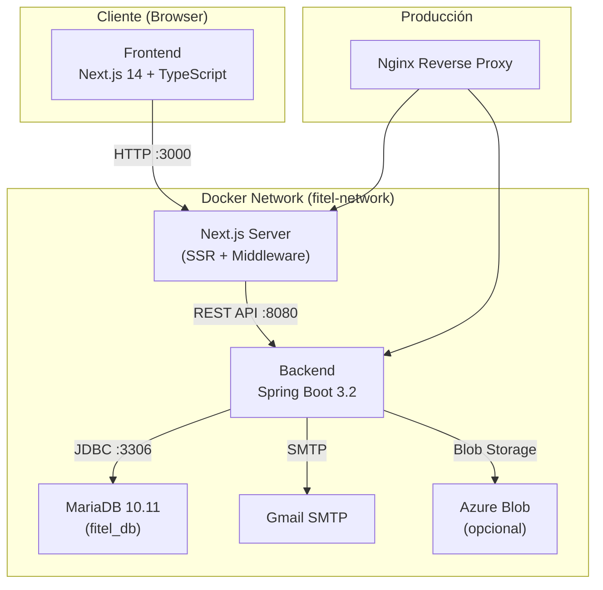
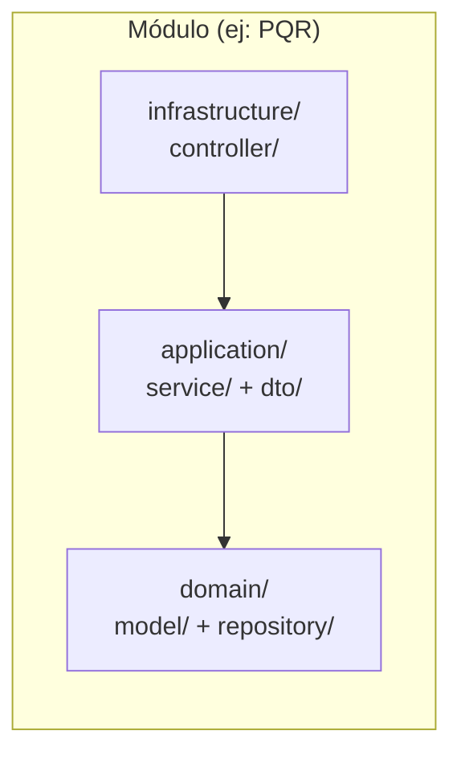
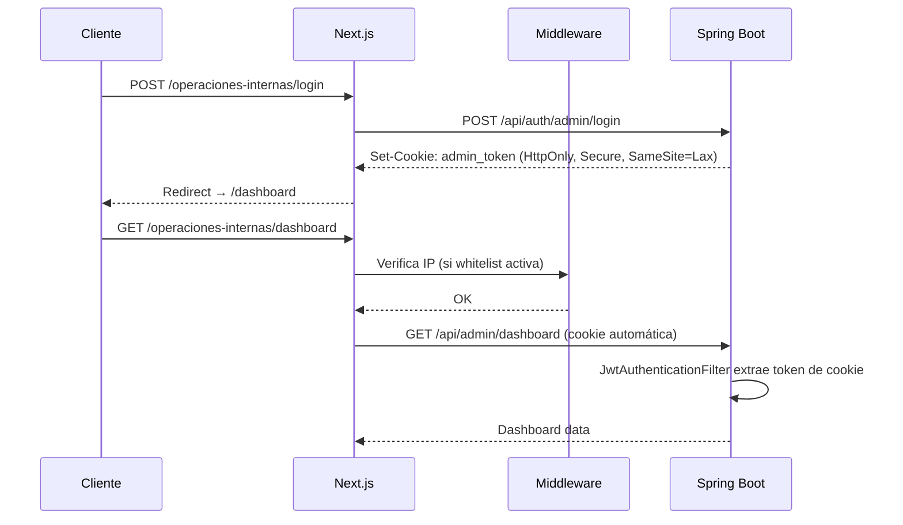
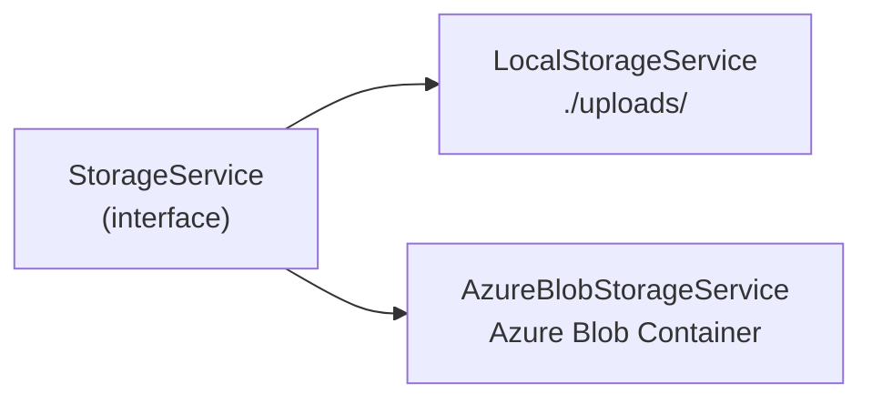
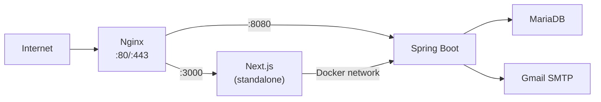

# FITEL Web — Análisis Completo del Proyecto

## 1. ¿Qué es FITEL Web?

**FITEL** es un proveedor de servicios de **Internet y Televisión** en Bogotá, Colombia. Este proyecto es su **plataforma web oficial**, que sirve tanto como sitio público para clientes como panel de administración interno para la empresa.

> [!IMPORTANT]
> El proyecto cumple con regulaciones colombianas de telecomunicaciones (SIC/CRC), incluyendo generación automática de CUN (Código Único Numérico) para PQRs y plazos de SLA de 15 días hábiles.

---

## 2. Arquitectura General



| Capa | Tecnología | Puerto |
|------|-----------|--------|
| **Frontend** | Next.js 14, React 18, TypeScript, Tailwind CSS | `:3000` |
| **Backend** | Spring Boot 3.2, Java 17, Spring Security, JPA | `:8080` |
| **Base de Datos** | MariaDB 10.11 | `:3306` (interno) / `:3307` (dev) |
| **Orquestación** | Docker Compose | — |

---

## 3. Estructura del Proyecto

```
Repositorio-oficial-FITEL-Web/
├── frontend/                    # App Next.js 14
│   └── src/
│       ├── app/                 # App Router (páginas)
│       │   ├── page.tsx                    # Homepage
│       │   ├── layout.tsx                  # Layout raíz (Header + Footer + ChatBot)
│       │   ├── pqrs/                       # Módulo PQR público
│       │   ├── planes/                     # Página de planes
│       │   ├── cobertura/                  # Mapa de cobertura
│       │   ├── contacto/                   # Formulario de contacto
│       │   ├── malla-canales/              # Malla de canales TV
│       │   ├── informacion-usuarios/       # Info legal usuarios
│       │   ├── politica-privacidad/        # Política de privacidad
│       │   ├── terminos-condiciones/       # T&C
│       │   ├── operaciones-internas/       # 🔒 Panel Admin
│       │   │   ├── login/                  # Login admin
│       │   │   ├── dashboard/              # Dashboard con stats
│       │   │   ├── pqrs/                   # Gestión PQRs
│       │   │   ├── planes/                 # CRUD planes
│       │   │   ├── canales/                # Gestión canales TV
│       │   │   ├── configuracion/          # Config contacto/carousel/email
│       │   │   ├── usuarios-ips/           # Gestión usuarios e IPs
│       │   │   ├── forgot-password/        # Recuperar contraseña
│       │   │   ├── reset-password/         # Resetear contraseña
│       │   │   └── security-alert/         # Alerta de seguridad
│       │   └── api/                        # API Routes de Next.js
│       ├── components/
│       │   ├── sections/        # Secciones del homepage (Hero, Plans, Benefits, etc.)
│       │   ├── admin/           # Componentes del panel admin
│       │   ├── layout/          # Header, Footer, Dropdowns
│       │   ├── chatbot/         # ChatBot inteligente
│       │   ├── pqrs/            # Componentes PQR públicos
│       │   ├── coverage/        # Mapa de cobertura (Leaflet)
│       │   └── plans/           # Componentes de planes
│       ├── services/            # Servicios de datos
│       │   ├── api/             # PlanService (fetch al backend)
│       │   ├── pqr/             # PQRService
│       │   ├── chatbot/         # ChatBotService (lógica rule-based)
│       │   └── navigation/      # NavigationService
│       ├── hooks/               # usePQRSearch (custom hook)
│       ├── types/               # Interfaces TypeScript (Plan, CoverageZone, etc.)
│       ├── config/              # Constantes (teléfonos, URLs)
│       ├── lib/                 # Utilidades (utils.ts)
│       └── middleware.ts        # IP Whitelist + protección rutas admin
│
├── backend/                     # API Spring Boot
│   └── src/main/java/co/com/fitel/
│       ├── FitelWebApplication.java        # Entry point
│       ├── common/                         # Capa transversal
│       │   ├── config/          # SecurityConfig, WebConfig, CORS
│       │   ├── security/        # JwtAuthenticationFilter
│       │   ├── dto/             # ApiResponse<T> (envolvente estándar)
│       │   ├── exception/       # GlobalExceptionHandler, BusinessException
│       │   ├── service/         # EmailService, StorageService, FileStorageService
│       │   ├── infrastructure/  # LocalStorageService, AzureBlobStorageService
│       │   └── audit/           # AuditableEntity (JPA Auditing)
│       └── modules/                        # Módulos de negocio
│           ├── auth/            # Autenticación y gestión usuarios/IPs
│           ├── pqr/             # Peticiones, Quejas y Recursos
│           ├── plans/           # Planes de Internet/TV
│           ├── config/          # Configuración (contacto, carousel, email)
│           ├── channels/        # Canales de televisión
│           └── audit/           # Logs de operaciones
│
├── database/
│   ├── sql/                     # 18+ scripts SQL migracionales
│   └── init/                    # Scripts de inicialización Docker
│
├── scripts/                     # Scripts de deploy (Azure, VPS)
├── docs/                        # Documentación (7 archivos .md)
├── docker-compose.yml           # Desarrollo
└── docker-compose.prod.yml      # Producción
```

---

## 4. Backend — Arquitectura por Módulos

Cada módulo sigue una **arquitectura hexagonal simplificada** con 3 capas:



| Capa | Responsabilidad | Ejemplo |
|------|----------------|---------|
| **infrastructure/controller** | Endpoints REST, validación HTTP | `PQRController`, `PQRManagementController` |
| **application/service + dto** | Lógica de negocio, DTOs, mappers | `PQRService`, `CreatePQRRequest` |
| **domain/model + repository** | Entidades JPA, interfaces de repositorio | `PQR.java`, `PQRRepository` |

### 4.1 Módulo Auth (`modules/auth/`)

**Responsabilidad**: Autenticación JWT, gestión de usuarios admin y whitelist de IPs.

**Endpoints principales**:
- `POST /api/auth/admin/login` → Login con cookies HttpOnly (admin_token + admin_session)
- `GET /api/auth/admin/verify` → Verificar token
- `GET /api/auth/admin/me` → Obtener usuario actual
- `POST /api/auth/admin/logout` → Cerrar sesión (borrar cookies)
- `POST /api/auth/admin/change-password/init` → Iniciar cambio con código por email
- `POST /api/auth/admin/change-password/confirm` → Confirmar cambio
- `POST /api/auth/admin/forgot-password` → Recuperación de contraseña
- `POST /api/auth/admin/reset-password` → Resetear con token
- `POST /api/auth/admin/revoke-sessions` → Revocar todas las sesiones ("No fui yo")

**Servicios clave**:
- `AuthService` → Login, JWT, password recovery, notificaciones de seguridad
- `AdminManagementService` → CRUD usuarios, gestión IPs
- `JwtService` → Generación/validación de tokens JWT
- `IPEncryptionService` → Encriptación AES-256 de IPs almacenadas

**Roles**: `ROLE_ADMIN` (acceso total) y `ROLE_OPERARIO` (acceso PQRs + dashboard)

### 4.2 Módulo PQR (`modules/pqr/`)

**Responsabilidad**: Gestión completa de Peticiones, Quejas y Recursos según normativa colombiana.

**Endpoints públicos** (`PQRController`):
- `POST /api/pqrs` → Crear PQR (multipart con archivos)
- `GET /api/pqrs/consultar?query=` → Buscar por CUN o documento
- `POST /api/pqrs/{cun}/reanalisis` → Solicitar recurso de reposición
- `GET /api/pqrs/constancia/{cun}` → Obtener constancia de radicación

**Endpoints admin** (`PQRManagementController`):
- CRUD completo, cambio de estados, respuestas con adjuntos

**Flujo de creación de PQR**:
1. Cliente envía formulario (con archivos opcionales)
2. Se sube archivos a storage (local o Azure)
3. Se guarda la PQR en BD → trigger SQL genera CUN automáticamente
4. Se hace flush + clear + reload para obtener el CUN del trigger
5. Se actualiza la descripción con URLs de archivos + CUN
6. Se envía constancia de radicación por email al cliente
7. Se envía notificación a la empresa

**SLA**: 15 días hábiles (solo lunes a viernes). Cumple Ley 1437 de 2011 (silencio administrativo positivo).

### 4.3 Módulo Plans (`modules/plans/`)

**Endpoints públicos**: `GET /api/public/plans`, `GET /api/public/plans/popular`
**Endpoints admin**: CRUD completo en `/api/admin/plans/**`

**Tipos de plan**: `BASIC`, `FAMILY`, `BUSINESS`, `GAMING`

### 4.4 Módulo Config (`modules/config/`)

Gestiona configuración dinámica del sitio:
- **Contacto**: WhatsApp, teléfono, email (público: `GET /api/config/contact`)
- **Carousel**: Imágenes del hero con orden configurable
- **Email**: Configuración SMTP para notificaciones

### 4.5 Módulo Channels (`modules/channels/`)

Gestión de la malla de canales de TV. Endpoints públicos y admin separados.

### 4.6 Módulo Audit (`modules/audit/`)

`OperationLogService` registra operaciones administrativas en tabla `operation_logs`.

---

## 5. Seguridad

### 5.1 Autenticación JWT con Cookies HttpOnly



### 5.2 Cadena de Filtros de Seguridad (Spring Security)

1. `ExceptionHandlerFilter` → Captura excepciones de filtros
2. `JwtAuthenticationFilter` → Extrae JWT de cookie `admin_token`, valida y establece `SecurityContext`
3. `SecurityFilterChain` → Reglas de autorización por endpoint y rol

### 5.3 Permisos por Rol

| Recurso | Público | OPERARIO | ADMIN |
|---------|---------|----------|-------|
| PQR (crear/consultar) | ✅ | ✅ | ✅ |
| Dashboard | ❌ | ✅ | ✅ |
| Gestión PQRs | ❌ | ✅ | ✅ |
| Gestión Planes | ❌ | ❌ | ✅ |
| Gestión Canales | ❌ | ❌ | ✅ |
| Gestión Usuarios/IPs | ❌ | ❌ | ✅ |
| Configuración | ❌ | ❌ | ✅ |

### 5.4 IP Whitelist (Middleware Next.js)

El archivo [middleware.ts](file:///c:/Users/sebas/Desktop/Repositorios/Repositorio-oficial-FITEL-Web/frontend/src/middleware.ts) controla acceso a `/operaciones-internas/*`:
- Flag `ENABLE_ADMIN_IP_WHITELIST` (actualmente `false`)
- Soporta IPs exactas y rangos CIDR
- IPs configuradas vía `ALLOWED_ADMIN_IPS` en env
- IPs almacenadas en BD están encriptadas con AES-256

### 5.5 Notificaciones de Seguridad

Al hacer login, se envía email al admin con IP, User-Agent y enlace "No fui yo" que permite revocar todas las sesiones activas.

---

## 6. Frontend — Detalle

### 6.1 Homepage (Sitio Público)

La homepage en [page.tsx](file:///c:/Users/sebas/Desktop/Repositorios/Repositorio-oficial-FITEL-Web/frontend/src/app/page.tsx) compone estas secciones:

| Sección | Componente | Descripción |
|---------|-----------|-------------|
| Hero | `Hero.tsx` + `ImageCarousel.tsx` | Carousel con degradado, CTA |
| Planes | `Plans.tsx` | Tarjetas de planes (fetch desde API) |
| Beneficios | `Benefits.tsx` | "¿Por qué elegir FITEL?" |
| Cobertura | `Coverage.tsx` | Mapa interactivo Leaflet.js |
| Sobre FITEL | `About.tsx` | Identidad corporativa |
| Contacto | `ContactPreview.tsx` + `Contact.tsx` | Formulario + datos de contacto |

### 6.2 Panel de Administración

Ruta base: `/operaciones-internas/`

| Página | Componente Principal | Funcionalidad |
|--------|---------------------|---------------|
| Login | Página login | Autenticación con cookies |
| Dashboard | `PQRChart.tsx` | Stats en tiempo real + gráfico Recharts |
| PQRs | `PQRDetailModal.tsx` (49KB!) | Gestión completa, modal detallado |
| Planes | `PlanManagement.tsx` | CRUD con activar/desactivar |
| Canales | `ChannelManagement.tsx` | Gestión malla TV |
| Config | `ContactConfig.tsx`, `CarouselConfig.tsx`, `EmailConfig.tsx` | Configuración dinámica |
| Usuarios/IPs | `UserManagement.tsx`, `IPManagement.tsx` | CRUD usuarios + IPs encriptadas |
| Contraseña | `ChangePassword.tsx` | Cambio con verificación por email |

### 6.3 ChatBot

- `ChatBot.tsx` + `ChatBotWrapper.tsx` → Chatbot rule-based (no IA)
- `ChatBotService.ts` (17KB) → Lógica de respuestas predefinidas
- Se oculta en rutas de login y administración

### 6.4 Servicios Frontend

| Servicio | Archivo | Responsabilidad |
|----------|---------|----------------|
| PlanService | `services/api/PlanService.ts` | Fetch planes con fallback a defaults |
| PQRService | `services/pqr/PQRService.ts` | Crear/consultar PQRs |
| ChatBotService | `services/chatbot/ChatBotService.ts` | Lógica conversacional rule-based |
| NavigationService | `services/navigation/NavigationService.ts` | Utilidades de navegación |

---

## 7. Base de Datos

### 7.1 Tablas Principales

| Tabla | Propósito |
|-------|----------|
| `plans` | Planes de Internet/TV (velocidad, canales, precio, tipo) |
| `coverage_zones` | Zonas de cobertura por localidad |
| `pqr` | Peticiones, Quejas y Recursos (con CUN automático) |
| `pqr_appeals` | Apelaciones/recursos sobre PQRs |
| `contact_messages` | Mensajes del formulario de contacto |
| `admin_users` | Usuarios administradores (con hash BCrypt) |
| `allowed_admin_ips` | IPs permitidas (encriptadas AES-256) |
| `contact_config` | Config dinámica de contacto |
| `carousel_images` | Imágenes del carousel con orden |
| `system_config` | Configuración key-value del sistema |
| `audit_logs` | Logs de auditoría (entidad, acción, old/new JSON) |
| `operation_logs` | Logs de operaciones admin |

### 7.2 Scripts SQL (Migracionales)

Los scripts en `database/sql/` se ejecutan en orden numérico:

| Script | Contenido |
|--------|----------|
| `01_create_tables.sql` | 9 tablas base |
| `02_insert_initial_data.sql` | Datos semilla (planes, zonas) |
| `03_create_indexes.sql` | Índices de rendimiento |
| `04_create_views.sql` | Vistas SQL |
| `05_create_functions.sql` | Función `generate_cun()` |
| `06_create_triggers.sql` | Trigger `trg_pqr_generate_cun` |
| `07-08` | Admin users + IPs permitidas |
| `09` | Migración IPs a formato encriptado |
| `10-12` | Tablas de config, email |
| `13-18` | Logs, campos adicionales, canales, seguridad |

### 7.3 Generación de CUN

La función SQL `generate_cun()` genera un código con formato: `[CONVENIO][AÑO][SECUENCIA]`
El trigger `trg_pqr_generate_cun` lo asigna automáticamente al insertar una PQR.

---

## 8. Almacenamiento de Archivos

Patrón **Strategy** para storage:



- Configurado vía `STORAGE_PROVIDER` (valores: `local`, `azure`)
- Archivos subidos por PQRs y carousel se almacenan según el provider
- Límite: 50MB por archivo, 50MB total por request

---

## 9. Email

`EmailService` maneja todas las notificaciones:
- **Constancia de radicación PQR** → al cliente
- **Notificación de nueva PQR** → a la empresa
- **Reanálisis PQR** → al cliente
- **Alerta de login** → al admin (con enlace "No fui yo")
- **Recuperación de contraseña** → al usuario
- **Código de verificación** → para cambio de contraseña

Configuración SMTP vía Gmail App Password. Si falla, no bloquea la operación principal (failsafe).

---

## 10. Despliegue

### Desarrollo

```bash
docker-compose up -d    # Levanta MariaDB + Backend + Frontend
# Frontend: http://localhost:3000
# Backend:  http://localhost:8080
# MariaDB:  localhost:3307
```

### Producción (VPS)

- `docker-compose.prod.yml` con variables de `.env`
- Frontend y Backend solo escuchan en `127.0.0.1` (Nginx hace proxy)
- Next.js usa `output: 'standalone'` para imagen Docker optimizada
- En producción, rewrites apuntan a `http://fitel-backend:8080` (red Docker interna)
- Scripts de deploy: `scripts/vps-deploy.sh`, `scripts/deploy-azure.ps1`
- Jib Maven Plugin configurado para push a Azure Container Registry (`acrfiteldemo.azurecr.io`)

### Diagrama de Despliegue (Producción)



---

## 11. Respuesta API Estándar

Todas las respuestas del backend siguen el formato `ApiResponse<T>`:

```json
{
  "success": true,
  "message": "Operación exitosa",
  "data": { ... },
  "timestamp": "2026-01-15T10:30:00"
}
```

---

## 12. Dependencias Clave

### Backend
| Dependencia | Uso |
|-------------|-----|
| Spring Boot 3.2 | Framework base |
| Spring Security | Autenticación/autorización |
| Spring Data JPA | ORM con Hibernate |
| MariaDB JDBC 3.3.3 | Conector BD |
| jjwt 0.12.3 | Tokens JWT |
| Lombok | Reducción boilerplate |
| MapStruct 1.5.5 | Mapeo DTO ↔ Entity |
| Azure Storage Blob | Storage cloud opcional |
| Spring Mail | Envío de emails |
| Actuator | Health/metrics endpoints |

### Frontend
| Dependencia | Uso |
|-------------|-----|
| Next.js 14 | Framework React SSR |
| Tailwind CSS 3.4 | Estilos utility-first |
| React Hook Form + Zod | Formularios con validación |
| Leaflet + React-Leaflet | Mapas de cobertura |
| Recharts | Gráficos del dashboard |
| Lucide React | Iconos |

---

## 13. Roadmap Pendiente

- [ ] Tests automatizados (Jest, JUnit)
- [ ] CI/CD Pipeline
- [ ] Documentación API (Swagger/OpenAPI)
- [ ] Notificaciones por email (parcialmente implementado)
- [ ] Dashboard de métricas avanzadas
- [ ] Exportación de reportes (PDF, Excel)
